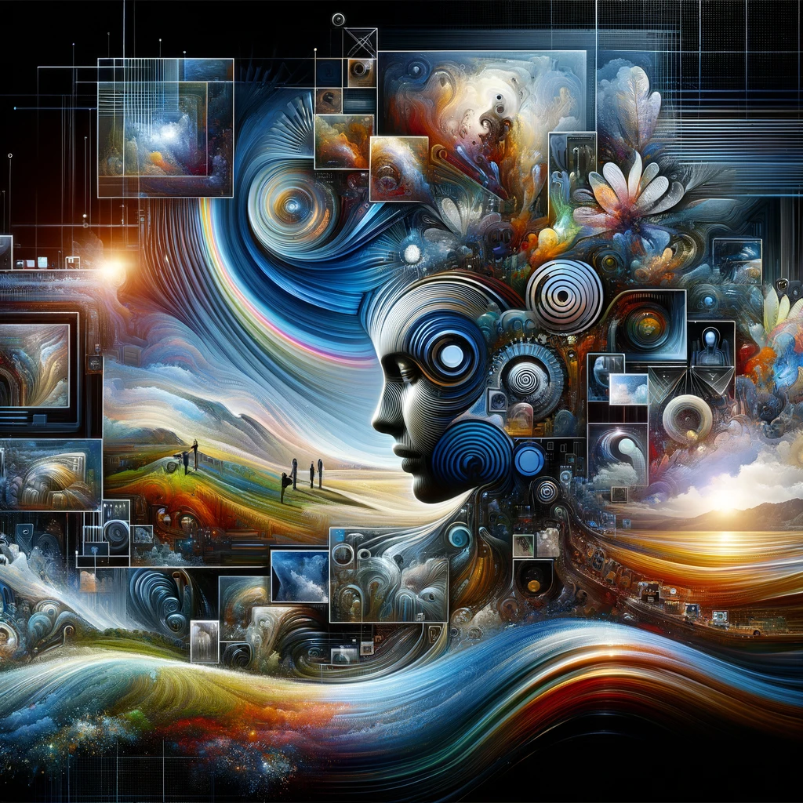

# LCM + Papercut Image-gen Interface

This application utilizes advanced AI models, including Stable Diffusion and various adapters, to generate and modify images based on textual prompts. It integrates Gradio for a user-friendly interface, allowing users to interact with different functionalities like image generation, inpainting, and image modification.



Full post and instructional available [here]()

### Setting up Conda Environment

Creating a dedicated Conda environment for your project is considered a best practice as it helps manage dependencies and avoid conflicts.

```bash
conda create --name torch python=3.10
conda activate torch
```

You should make sure that you have followed the correct steps located [here](https://pytorch.org/get-started/locally/) to install torch with GPU support
for your correct platform. If you have not done this, you will not be able to use the GPU.

I am on linux for example, so this would be my install command using conda.

```bash
conda install pytorch torchvision torchaudio pytorch-cuda=12.1 -c pytorch-nightly -c nvidia
```
Build the correct command for your machine on the website and make sure its installed properly by testing if torch has access to the gpu.

You do not need to locally install CUDA or cudnn, pytorch ships with prebuilt binaries for each version. These steps alone are enough for torch to see your GPU.


## Installation

To set up this application, ensure you have Python installed. Then, install the required libraries using pip:

```bash
git clone https://github.com/tdolan21/lcm-lora-sdxl-papercut.git
cd lcm-lora-sdxl-papercut
pip install -r requirements.txt
```
Once you have the requirements installed you can start the application with:

```bash
gradio app.py
```


